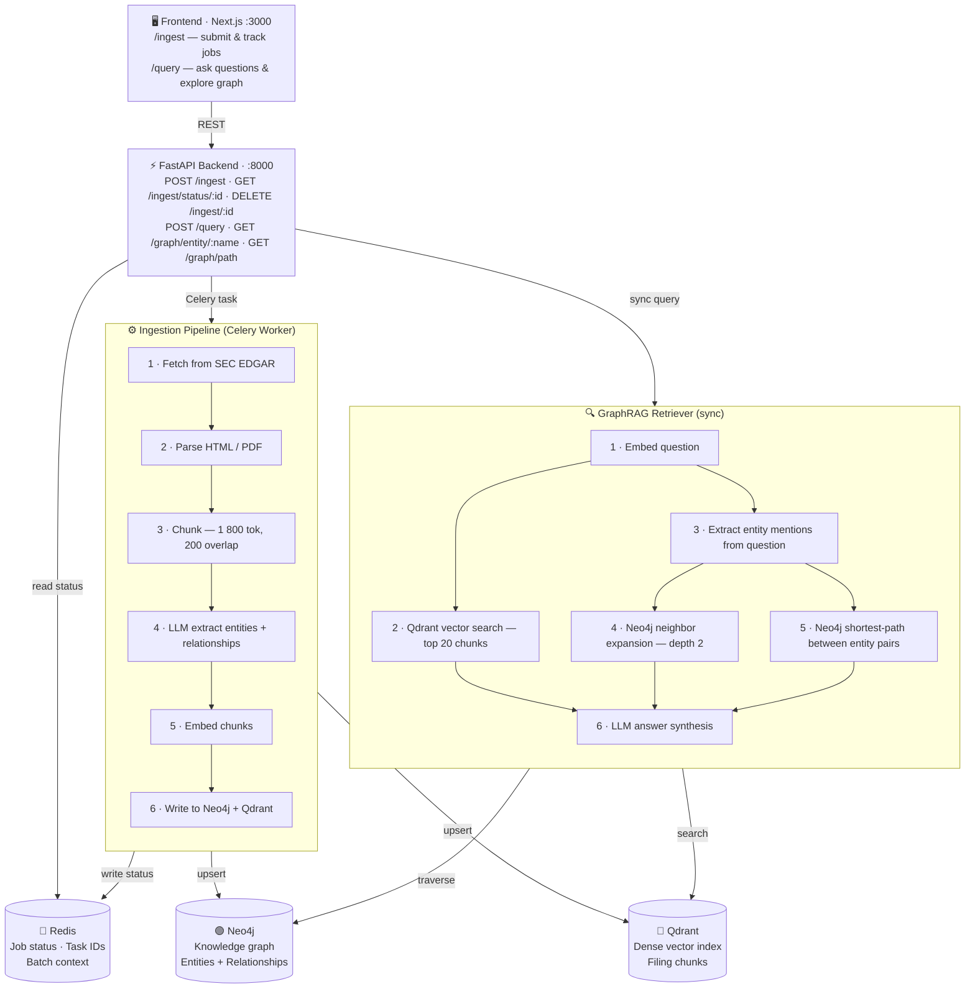
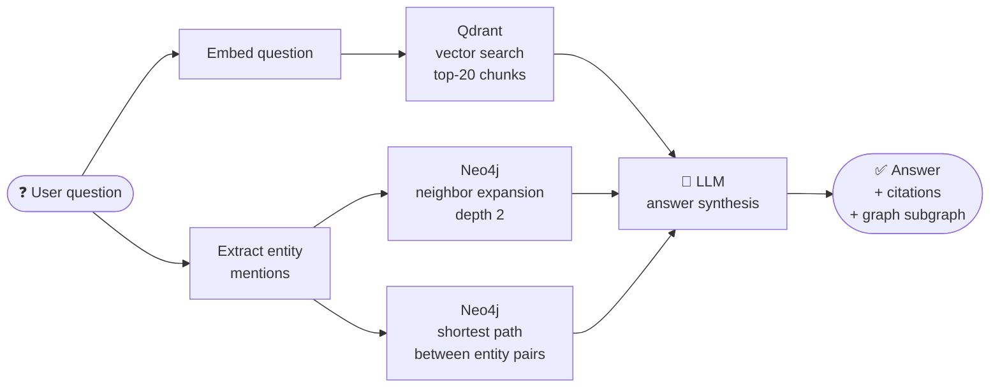

# SEC Graph — AI Financial Intelligence Platform

A **GraphRAG** system that ingests SEC filings (10-K / 10-Q / 8-K), extracts entities and relationships with OpenAI models, and lets you ask complex financial intelligence questions that combine graph traversal with semantic search.

Standard RAG can retrieve relevant text passages. GraphRAG also traverses the *relationships between companies, people, risks, and products* that span across multiple filings — answering questions that no single document can answer alone.

---

## Use Cases

| Question type | How GraphRAG answers it |
|---|---|
| *"Which suppliers are indirectly dependent on NVIDIA?"* | Follows `SUPPLIES_TO → DEPENDS_ON` chains across the graph |
| *"Which companies mention supply-chain risk related to TSMC?"* | Combines vector search (risk language) with graph edges (`EXPOSED_TO_RISK`) |
| *"Show how OpenAI, Microsoft, and GPU vendors are connected"* | Shortest-path traversal between three entities simultaneously |
| *"Which executives appear across multiple semiconductor companies?"* | `Person --EMPLOYS-- Company` edges across different tickers |
| *"What acquisitions has Apple made in the last 3 years?"* | `ACQUIRED` relationship edges filtered by `filed_date` |
| *"Which cybersecurity firms are repeatedly linked to ransomware incidents?"* | Vector retrieval of incident language + graph clustering of `EXPOSED_TO_RISK` edges |

---

## Architecture



### Entity & Relationship Types

**Entities** extracted from filing text:
`Company` · `Person` · `Product` · `Risk` · `Industry` · `Location` · `Regulation`

**Relationships** written to the graph:
`INVESTED_IN` · `SUPPLIES_TO` · `ACQUIRED` · `COMPETES_WITH` · `EXPOSED_TO_RISK` · `MANUFACTURES` · `PARTNERS_WITH` · `SUED_BY` · `EMPLOYS` · `REGULATES` · `DEPENDS_ON`

### Ingestion — two modes

**Real-time** (`use_batch: false`, default)
Each chunk is sent to the configured OpenAI model immediately. Results appear within minutes. Higher cost.

**Batch** (`use_batch: true`)
All chunks for a filing are uploaded as a single JSONL file to the OpenAI Batch API (50 % cheaper). Results return within 24 h. The UI polls for completion and shows a `waiting_for_batch` status until done.

### GraphRAG Retrieval Flow



---

## Tech Stack

| Layer | Technology |
|---|---|
| LLM | OpenAI models (configurable — extraction + answering) |
| Embeddings | OpenAI `text-embedding-3-small` |
| Knowledge graph | Neo4j 5 + APOC |
| Vector store | Qdrant |
| Task queue | Celery + Redis |
| Backend | FastAPI (Python 3.12) |
| Frontend | Next.js 14 (App Router), Tailwind CSS |
| Graph viz | react-force-graph-2d |
| Entity resolution | rapidfuzz fuzzy matching |
| Parsing | BeautifulSoup4, pdfplumber |
| Chunking | LangChain `RecursiveCharacterTextSplitter` (1 800 tok, 200 overlap) |

---

## Getting Started

### Prerequisites

- Docker & Docker Compose
- OpenAI API key

### 1 — Clone and configure

```bash
git clone https://github.com/your-username/sec-graph.git
cd sec-graph
cp .env.example .env
```

Edit `.env`:

```env
OPENAI_API_KEY=sk-...

```

### 2 — Start all services

```bash
docker compose up --build
```

This starts six containers:

| Container | Port | Purpose |
|---|---|---|
| `frontend` | 3000 | Next.js UI |
| `backend` | 8000 | FastAPI + auto-reload |
| `worker` | — | Celery worker (4 concurrent tasks) |
| `neo4j` | 7474 / 7687 | Graph database + APOC |
| `qdrant` | 6333 | Vector store |
| `redis` | 6379 | Celery broker + job status |

Open **http://localhost:3000** once all containers are healthy (≈ 30 s first run).

### 3 — Ingest your first filing

1. Go to **http://localhost:3000** (Ingest page)
2. Enter a ticker, e.g. `NVDA`
3. Select form type (`10-K`) and year(s)
4. Click **Start Ingestion**

The job panel on the right shows live progress through `downloading → parsing → chunking → extracting → embedding → complete`.

Enable **Batch mode** to use the OpenAI Batch API (50 % cheaper, results in up to 24 h).

### 4 — Query the graph

1. Go to **http://localhost:3000/query**
2. Ask a question in natural language
3. The answer panel shows the response with source citations
4. The force graph below visualises the subgraph traversed to build the answer
5. Click any node to expand its neighbourhood


### Cost optimisation

| Scenario | Recommended config |
|---|---|
| Development / testing | `OPENAI_EXTRACTION_MODEL=gpt-5.4-mini` + `max_chunks=20` via API |
| Production quality | `OPENAI_EXTRACTION_MODEL=gpt-5.4` or any capable chat model |
| High volume (many filings) | Enable **Batch mode** in the UI — 50 % cheaper, async |


---

## Design Decisions

**Why Neo4j + Qdrant instead of just a vector DB?**
Vector search finds *similar text*. A graph finds *connected entities across documents*. Asking "what are NVIDIA's indirect supply chain dependencies?" requires following relationship chains — something embeddings alone cannot do.

**Why Celery for ingestion?**
A single 10-K filing can produce 200+ chunks, each requiring an LLM call. Running this synchronously in a web request would time out and make the backend unresponsive. Celery workers process chunks concurrently and write progress to Redis for the frontend to poll.

**Why idempotent upserts?**
Both Qdrant (uuid5-based point IDs from `chunk_id`) and Neo4j (MERGE on entity name) are idempotent — re-ingesting the same filing extends/updates the graph rather than duplicating data.

**Why entity resolution?**
Language models produce inconsistent names: "NVIDIA Corporation", "Nvidia", "NVDA". rapidfuzz fuzzy matching (token sort ratio ≥ 90) maps these to a canonical name stored in Redis, preventing duplicate graph nodes.

---

## Neo4j Browser

Access the graph directly at **http://localhost:7474** (user: `neo4j`, password: from `.env`).

Useful queries:

```cypher
// All companies and their relationships
MATCH (a:Company)-[r]->(b) RETURN a, r, b LIMIT 100

// Supply chain for a specific company
MATCH (n {name: "NVIDIA"})-[r:SUPPLIES_TO|DEPENDS_ON*1..3]-(m)
RETURN n, r, m

// Most connected entities
MATCH (n)-[r]-()
RETURN n.name, count(r) AS degree
ORDER BY degree DESC LIMIT 20
```

---

## License

[MIT](LICENSE) © 2025 Julian Dehs
